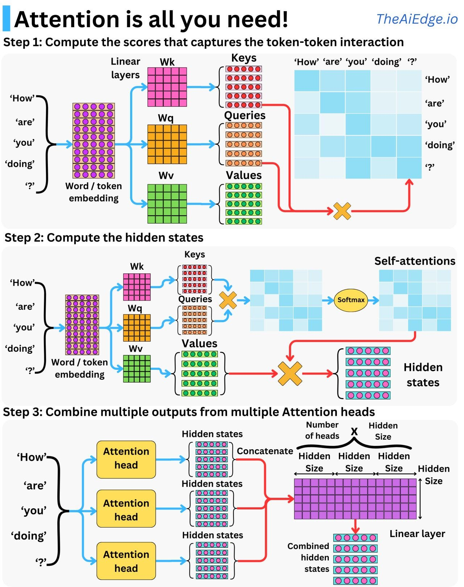

# 🧠 What is Multi Head Attention in Transformers

Multi Head Attention is a key component of the Transformer architecture.  
It allows the model to focus on different types of relationships in the input at the same time.  
Instead of computing one attention pattern, the model computes several parallel attention heads and combines their outputs.

---

## 🔍 What Multi Head Attention Does

A single attention head can capture only one type of relationship.  
For example, it might learn grammar patterns, or focus on nearby words only.  
Multi Head Attention solves this limitation by creating several attention heads, each learning a different representation of the sequence.

Each head processes:
- Query vectors  
- Key vectors  
- Value vectors  

And produces its own attention output.  
All heads are then concatenated and passed through a linear projection.

---

## ⚙️ How Multi Head Attention Works

1. The input embeddings are projected into separate sets of Q, K, V for each head.  
2. Each head performs scaled dot product attention on its own Q, K, V.  
3. The outputs of all heads are concatenated.  
4. A final linear layer mixes this combined information.

This gives the model multiple perspectives on the data, improving understanding and contextual learning.

---

## 🧩 Why Multi Head Attention Is Important

- Captures different patterns in the same sequence  
- Learns syntax, meaning, position and long context in parallel  
- Helps the model understand complex dependencies  
- Improves performance on tasks like translation, summarization and text generation  

Multi Head Attention is one of the main reasons Transformers outperform RNNs and LSTMs on modern deep learning tasks.

---

## ✔️ Benefits

- Better representation learning  
- Parallel processing of attention  
- More expressive modeling power  
- Reduced risk of losing important contextual details  

---
<!-- Add image  -->

  

## 📚 Research Papers

- Vaswani et al., Attention Is All You Need  
- A Comprehensive Survey on Applications of Transformers for Deep Learning Tasks  
- Reformer The Efficient Transformer, 2020  
  - Abstract link: https://arxiv.org/abs/2006.16362  
  - PDF link: https://arxiv.org/pdf/2006.16362 